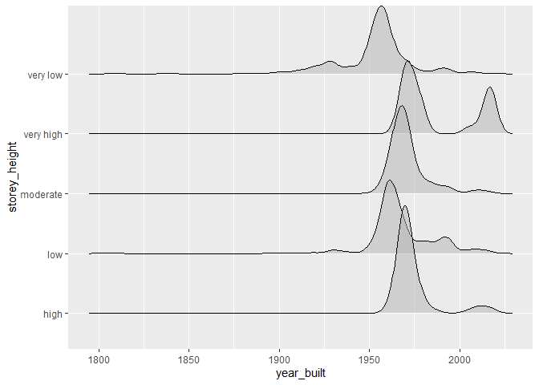
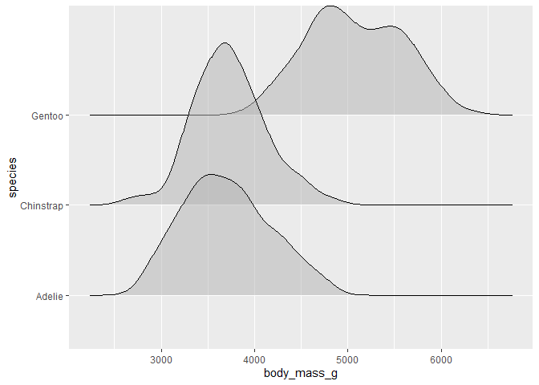

Assignment B-1
================
Jingwen Zhou

### Load libraries

``` r
suppressMessages(library(datateachr))
suppressMessages(library(datateachr))
suppressMessages(library(testthat))
suppressMessages(library(tidyverse))
suppressMessages(library(dplyr))
suppressMessages(library(scales))
suppressMessages(library(gapminder))
suppressMessages(library(palmerpenguins))
```

### Exercise 1 & 2: Make a Function & Document the Function

``` r
#' Summary statistics or numeric variable
#' 
#' @description
#' This function do the summary statistics of one given numerical variable 
#' across the groups of another given variable in a given dataset. 
#' It also calculates density estimates between two variables and 
#' plots the data using the ridgeline visualization. 
#'
#' @param data The dataset which need to be explore. 
#' This parameter is named `data` because it tells the user intuitively that 
#' we need a dataset as the first parameter.
#' 
#' @param x The numeric column name, which need to be summarized
#' This parameter is named `x` because when I plot the ridgeline graph to show the 
#' distribution, the x-axis is corresponding to this numeric variable.
#' 
#' @param y Another column name, the dataset can be grouped by this variable
#' This parameter is named `y` because when I plot the ridgeline graph to show the 
#' distribution, the y-axis is corresponding to this variable.
#' 
#' @return summarise_result: A list which contains the mean, range, median of numeric variable
#' 
#' @examples
#' result1 <- fun(apt_building, year_built, storey_height)
#' result2 <- fun(penguins, body_mass_g, species)
#' result3 <- fun(gapminder, lifeExp, continent)
#' 
fun <- function(data, x, y) {
  calculations <- summarise(data,
                            is_numeric_x = is.numeric({{x}}),
                            class_x = class({{x}}))
  
  if (!calculations$is_numeric_x){
    stop("Selected column is not numeric. ",
         "Class of x is: ",
         calculations$class_x)
  }
  summarise_result <- data %>%
    group_by({{y}}) %>%
    summarise(mean = mean({{x}}, na.rm = TRUE),
              range = range({{x}}, na.rm = TRUE),
              median = median({{x}}, na.rm = TRUE),
              .groups = 'keep')
  
  plot <- data %>%
  ggplot(aes({{x}}, {{y}})) +
  ggridges::geom_density_ridges(alpha = 0.5)
  print(plot)
  
  return(summarise_result)
  
}
```

### Exercise 3: Include examples

Example 1 uses apt_buildings dataset to test the function. The first
argument passed to the function is apt_building, which is a tibble
(list). The second argument and the third argument are the column name
which I want to explore. I want to get the summarise ouput which include
the range, mean and median of variable ‘year built’ across the groups of
storey height from the data.

``` r
# Example 1: Use `apt_buildings` dataset
apt_building <- apt_buildings %>%
  mutate(storey_height = case_when(no_of_storeys < 5 ~ "very low",
                                 no_of_storeys < 10 ~ "low",
                                 no_of_storeys < 20 ~ "moderate",
                                 no_of_storeys < 30 ~ "high",
                                 TRUE ~ "very high"))

result1 <- fun(apt_building, year_built, storey_height)
```

    ## Picking joint bandwidth of 3.33

    ## Warning: Removed 13 rows containing non-finite values (stat_density_ridges).

<!-- -->

``` r
result1
```

    ## # A tibble: 10 x 4
    ## # Groups:   storey_height [5]
    ##    storey_height  mean range median
    ##    <chr>         <dbl> <dbl>  <dbl>
    ##  1 high          1974.  1959   1970
    ##  2 high          1974.  2019   1970
    ##  3 low           1968.  1805   1964
    ##  4 low           1968.  2018   1964
    ##  5 moderate      1971.  1900   1969
    ##  6 moderate      1971.  2019   1969
    ##  7 very high     1987.  1966   1977
    ##  8 very high     1987.  2019   1977
    ##  9 very low      1953.  1809   1956
    ## 10 very low      1953.  2019   1956

Example 2 uses penguins dataset to test the function. Use different
dataset is to make sure that the function is not limited to specific
inputs, and don’t have the magic numbers.

``` r
# Example 2: Use `penguins` dataset
result2 <- fun(penguins, body_mass_g, species)
```

    ## Picking joint bandwidth of 153

    ## Warning: Removed 2 rows containing non-finite values (stat_density_ridges).

<!-- -->

``` r
result2
```

    ## # A tibble: 6 x 4
    ## # Groups:   species [3]
    ##   species    mean range median
    ##   <fct>     <dbl> <int>  <dbl>
    ## 1 Adelie    3701.  2850   3700
    ## 2 Adelie    3701.  4775   3700
    ## 3 Chinstrap 3733.  2700   3700
    ## 4 Chinstrap 3733.  4800   3700
    ## 5 Gentoo    5076.  3950   5000
    ## 6 Gentoo    5076.  6300   5000

Exaple 3 shows how an error can be thrown in the function, if the second
argument is not a numeric column name, the function will stop running
and throws an error “Selected column is not numeric. Class of x is:
factor (or other type that is not numeric)”. This is because in our
function we need to calculate the mean, median and range on of this
parameter, it must be of type numeric.

``` r
# Example 3: Use `gapminder` dataset
result3 <- fun(gapminder, country, continent)
```

    ## Error in fun(gapminder, country, continent): Selected column is not numeric. Class of x is: factor

### Exercise 4: Test the Function

``` r
# expect_type(x, type) checks that typeof(x) is type.
# In this function, we check if the output type is consistent (all output is `list` type) 
test_that("The function returns a list", {
  expect_type(result1, "list")
  expect_type(result2, "list")
})
```

    ## Test passed

``` r
# expect_error() check that code throws an error with a message
# The second parameter should be numeric column name, this will cause function throw an error
test_that("Test the function input type", {
  expect_error(fun(gapminder, country, continent))
})
```

    ## Test passed

``` r
# Use expect_equal() to check the output content
sum <- penguins %>% # manually summarise the data
  group_by(species) %>%
  summarise(mean = mean(body_mass_g, na.rm = TRUE),
            range = range(body_mass_g, na.rm = TRUE),
            median = median(body_mass_g, na.rm = TRUE),
            .groups = 'keep')

test_that("Test the output content", {
  expect_equal(result2, sum) # result2 is the return output of the function
})
```

    ## Test passed
